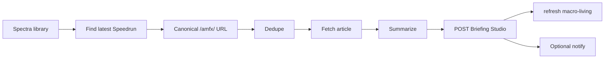

# Hermes Friday Speedrun workflow

**Target production flow.** Article ingest — **not** a transcript workflow. Briefing Studio replaces Notion as the destination.

## Source

The newsletter moved off Substack. Source of truth:

**https://www.spectramarkets.com/library**

Hermes watches the Spectra Markets library, not the old Substack feed.

---

## Flow



---

## 1) Library check (cron)

**Cron job:** e.g. *Donnelly Friday Speedrun Review* (Edgar profile on VPS).

**Schedule:** Fridays **16:00 Europe/London** minimum; can also poll the library periodically on Fridays afternoon if the article lands late.

**Behaviour:**

- Open the Spectra Markets library page
- Find the latest **Friday Speedrun** item
- Extract the **canonical article URL** — do not trust the card title as the link

Canonical URLs are usually under:

```
https://www.spectramarkets.com/amfx/...
```

Using the real `/amfx/...` URL avoids duplicates and tracking-link weirdness.

---

## 2) Normalize and dedupe

Before fetch or summarize:

- Strip tracking params (`utm_*`, etc.)
- Normalize the URL to a canonical form
- Check whether this edition was already ingested

**Dedup (target):**

| Old | New |
|-----|-----|
| Notion Reading Queue lookup | Local state file **or** Briefing Studio slug check |
| `notion_article_ingest.py` duplicate guard | `fetched-articles.json` on VPS, or slug `{date}-friday-speedrun` |

If already ingested → skip, return existing. No duplicate rows.

---

## 3) Fetch and summarize

- Fetch article HTML/text from the canonical URL
- Run Hermes summarizer (same skill chain used today)
- Output markdown matching `NEWSLETTER-SUMMARY-SPEC.md`

This is **article ingest**, not Supadata / YouTube transcript.

---

## 4) POST Briefing Studio

**Replace** `~/.hermes/scripts/notion_article_ingest.py` writes with:

```python
publish_to_briefing_studio({
    "type": "newsletter_summary",
    "title": f"Friday Speedrun — {edition_date_formatted}",
    "date": edition_date,           # YYYY-MM-DD (Friday)
    "show": "Friday Speedrun",
    "sources": ["Friday Speedrun"],
    "top_story": one_line_hook,
    "status": "ready",
    "content_markdown": summary_md,
})
```

See `HERMES-INGEST.md` for the HTTP helper.

**App routes:**

- Archive: `/macro/newsletter`
- Edition: `/macro/newsletter/{date}-friday-speedrun`

Then **refresh `macro-living`** — update the **Desk · Friday Speedrun** section and rerun Agreement / Disagreement. See `MACRO-BRIEFING-SPEC.md`.

---

## 5) Notify (optional)

**Old rule:** no Notion write, no Telegram ping.

**New rule:** no Briefing Studio POST success, no ping.

Telegram (or other notify) fires **only after** `POST /api/briefings` returns 201.

---

## 6) VPS config note

The cron initially failed under the Edgar profile because it could not see Notion config in the profile-local path. Fix was fallback to global Hermes config.

For Briefing Studio ingest, ensure the job has:

```
BRIEFING_STUDIO_URL
BRIEFING_INGEST_SECRET
```

in the environment visible to that cron profile.

---

## 7) Plain English

1. Watch Spectra Markets library
2. Find the latest Friday Speedrun article
3. Extract canonical `/amfx/...` URL
4. Normalize and dedupe
5. Fetch article → summarize
6. POST to Briefing Studio
7. Refresh macro overview
8. Notify only after successful ingest

---

## 8) Deprecated — do not use

| Old path | Replacement |
|----------|-------------|
| Substack feed | Spectra library |
| `notion_article_ingest.py` → Notion Reading Queue | `publish_to_briefing_studio()` |
| Notion dedupe | Local state + Studio slug |
| Notion-before-ping rule | Studio-before-ping rule |

---

## 9) Side-by-side with podcasts

| | **Podcasts** | **Friday Speedrun** |
|--|--------------|---------------------|
| Source | YouTube channels (`config.json`) | Spectra library |
| Input | Video transcript (Supadata) | Article HTML |
| Cadence | On new episode (cron 30–60m) | Weekly Fri ~16:00 UK |
| Hermes doc | `HERMES-PODCAST-WORKFLOW.md` | this file |
| Studio type | `podcast_summary` | `newsletter_summary` |
| App archive | `/macro/episodes` | `/macro/newsletter` |
| Macro desk | `Desk · {show name}` | `Desk · Friday Speedrun` |
| Approval gate | None | None |

Both feed the living doc at `/macro` (`macro-living`).
