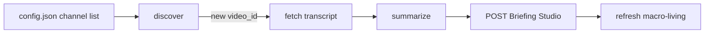

# Hermes podcast workflow

**Target production flow.** Briefing Studio is the product — **no Notion**, **no approval gate**. Every new episode from the curated channel list gets transcribed, summarized, and ingested automatically.

## Two layers

1. **Discovery** — detect new uploads (cheap, no transcript yet)
2. **Fetch + summarize + ingest** — automatic for every new episode that passes title filters



---

## 1) Discovery — watches the podcast list

**Purpose:** Find new uploads from curated channels. Dedupe locally. No human triage.

**Channel source of truth (today):**

```
~/.hermes/podcast-transcripts/config.json
```

Each entry:

- YouTube handle
- Human-friendly channel name (maps to `show` in ingest)
- Optional **title filters** — auto-skip noisy episodes (e.g. members-only Q&A). This is mechanical filtering, not an approval gate.

**Macro channels (current):**

| Handle | Videos URL | `show` name |
|--------|------------|-------------|
| `@1000xNetwork` | https://www.youtube.com/@1000xNetwork/videos | 1000x Network |
| `@ForwardGuidanceBW` | https://www.youtube.com/@ForwardGuidanceBW/videos | Forward Guidance |
| `@CapitalFlowsResearch` | https://www.youtube.com/@CapitalFlowsResearch/streams | Capital Flows Research |

Note: Capital Flows uses `/streams` — discovery should watch that path, not `/videos`.

**Target script:** refactor from `podcast_notion_pipeline.py discover` → app-first discover (or revive `fetch_podcasts.py` / `podcast_pipeline.py` with Studio ingest).

**Behaviour:**

- `yt-dlp --flat-playlist` on each channel `/videos` page
- Check recent uploads (default `--recent 5`, tune per channel cadence)
- Dedupe against local state (see below)
- Apply title filters → skip excluded titles
- **Every remaining new episode** → queue for transcript fetch (no Fetch/Maybe/Skip triage, no human step)

---

## 2) Transcript fetch + summarization + ingest

**Purpose:** For each newly discovered episode, fetch transcript, summarize, POST to Briefing Studio.

**Behaviour:**

1. Read Video ID + Source URL from discovery queue
2. Fetch transcript from **Supadata**  
   `https://api.supadata.ai/v1/youtube/transcript?videoId=...&text=true`
3. Save raw JSON to  
   `~/.hermes/podcast-transcripts/podcasts/market-macro/<channel-slug>/<video_id>.json`
4. Run `~/.hermes/skills/podcast-transcript-summarizer/scripts/summarize.py`
5. Save summary markdown to  
   `~/.hermes/podcast-transcripts/summaries/<channel-slug>/<video_id>-<slugified-title>.md`
6. **`POST /api/briefings`** with `type: podcast_summary` (see `PODCAST-SUMMARY-SPEC.md`)
7. Regenerate and upsert `type: macro_briefing` slug `macro-living` (see `MACRO-BRIEFING-SPEC.md`)
8. Mark video_id processed in local dedup state

On failure: log error, mark failed in local state, retry on next cron run.

**No Notion intake queue. No Notion reading queue. The app is where you read.**

---

## 3) Briefing Studio output

| Hermes POST | App route |
|-------------|-----------|
| `podcast_summary` | `/macro/episodes` + `/macro/episodes/{slug}` |
| `macro_briefing` | `/macro` (living dashboard) |

Use `publish_to_briefing_studio()` from `HERMES-INGEST.md`.

### Payload mapping

| Episode field | Briefing Studio field |
|---------------|----------------------|
| Episode title | `title` |
| Upload date | `date` (YYYY-MM-DD) |
| Channel display name | `show` + `sources[0]` |
| Episode subtitle / guest | `episode` + `top_story` |
| Summary markdown | `content_markdown` |
| Video ID | in markdown body |
| Source URL | link in markdown |

Slug: `{upload-date}-{show-slug}` — auto-resolved from `show` if omitted.

---

## 4) State and dedup

Local files on the VPS — not Notion.

| File | Purpose |
|------|---------|
| `discovered.json` (rename from `notion_discovered.json`) | Video IDs seen by discovery |
| `fetched.json` | Video IDs fully processed (transcript + summary + Studio ingest) |
| `podcasts/market-macro/` | Raw transcript archive |
| `summaries/` | Summary markdown archive |

A video is only re-processed if ingest failed and retry is needed.

---

## 5) Cron (target)

| Job | Schedule | Behaviour |
|-----|----------|-----------|
| Discover + process | Every 30–60 min, or discover 6h + process 30m | Quiet when nothing new |

One combined cron is fine if simpler: discover new → immediately process queue.

---

## 6) Deprecated — do not use

| Old path | Why retired |
|----------|-------------|
| Notion Podcast Intake Queue | Replaced by Briefing Studio |
| Notion Podcast Reading Queue | Replaced by `/macro/episodes` |
| Approval gate (`Candidate` → `Approved for Transcript`) | Removed — summarize all from list |
| `podcast_notion_pipeline.py` Notion writes | Retire after Studio cutover |

The old `fetch_podcasts.py` / `podcast_pipeline.py` automatic-fetch pattern is the **right shape** for the new flow — adapt it to POST Briefing Studio instead of GitHub/Notion.

---

## 7) Plain English

1. Hermes watches a curated list of YouTube podcast channels
2. yt-dlp finds new uploads
3. Title filters auto-skip junk (members-only, etc.)
4. **Every other new episode** → Supadata transcript → summarize
5. POST episode to Briefing Studio
6. Refresh the living macro dashboard
7. You read everything in the app

---

## 8) Friday Speedrun (separate)

Not part of the podcast pipeline. See `HERMES-FRIDAY-SPEEDRUN-WORKFLOW.md`.

Spectra library → article summarize → `newsletter_summary` → `/macro/newsletter`. Feeds `macro-living` desk for Brent Donnelly.

---

## 9) Hermes implementation sketch

```python
def process_new_episode(episode):
  transcript = fetch_supadata(episode.video_id)
  save_transcript(transcript, episode)
  summary_md = summarize(transcript_path)

  publish_to_briefing_studio({
      "type": "podcast_summary",
      "title": f"{episode.show} — {episode.title}",
      "date": episode.upload_date,
      "show": episode.show,
      "episode": episode.title,
      "top_story": first_bullet(summary_md),
      "status": "ready",
      "content_markdown": summary_md,
  })

  refresh_macro_living()  # upsert macro_briefing slug macro-living
  mark_fetched(episode.video_id)
```

---

## 10) Future: sources in the app

Today channels live in `config.json` on the VPS. Later the `sources` table in Supabase becomes editable from Briefing Studio settings UI, and Hermes reads from there instead of the local file.
